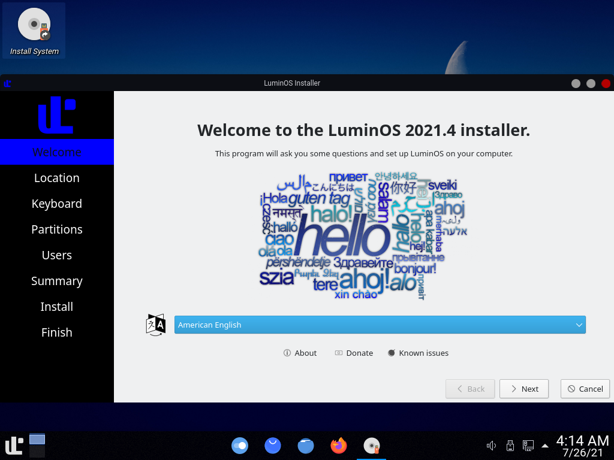
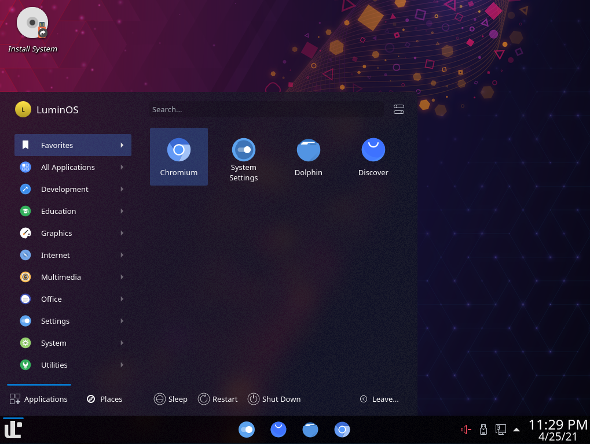
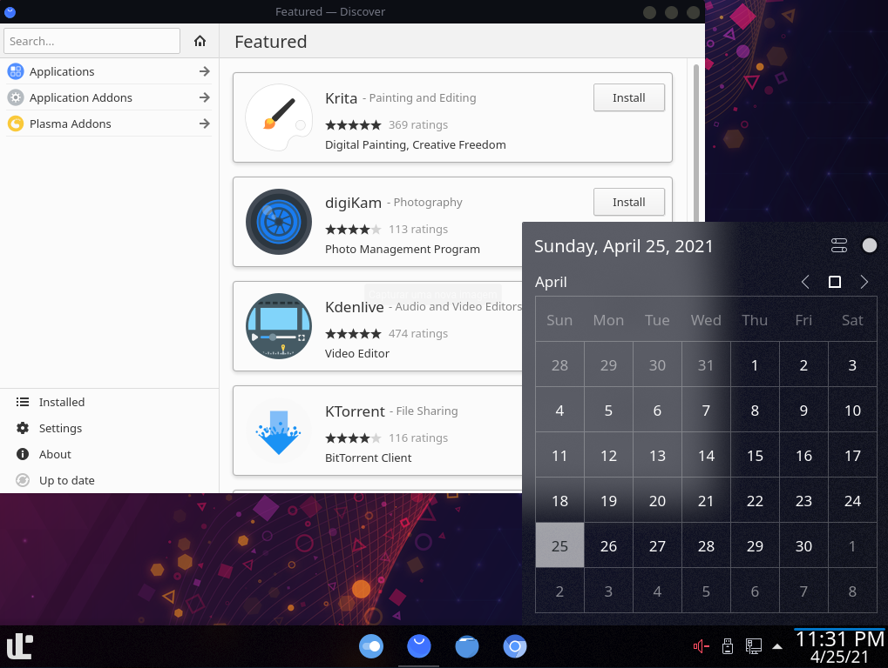
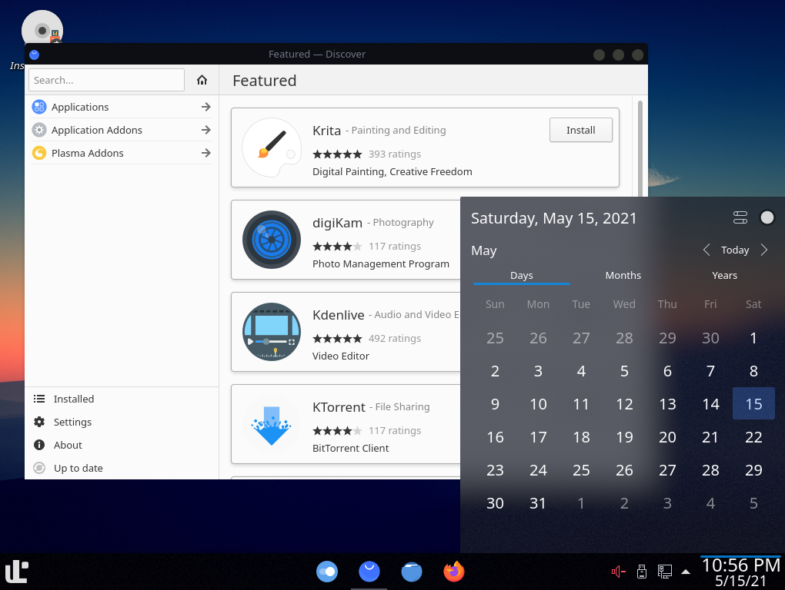

  
  
  
  
  

Focus on what matters. Based on <a href="https://www.archlinux.org">Arch Linux</a>.

## Screenshots

  
  
  
  

## Features

- Use GNOME Shell as default DE;
- PipeWire and GameMode enabled by default;
- Plymouth theme with BIOS logo on boot;
- Use rEFInd as default boot loader with native theme;
- Theme made for the system itself, maintaining a harmonious look between the apps;
- GNOME default configurations to improve performance and usability;
- Own installer for easy installation of the system;
- Extensions made for usability of system and for the luminus;
- Terminal with ZSH configured for better productivity;
- And more...

## Requirements

For your system
 - A UEFI System Compatible
 - KVM CPU Compatible

You need install these packages to build the ISO.

 - Pacman
 - Pacstrap
 - Git
 - QEMU
 - mksquashfs
 - xorriso

Get the source code.

    git clone https://github.com/luminusOS/mkluminus.git
    cd mkluminus

## Build

Just type the command

    sudo sh build.sh

For build with silent mode, just type

    sudo sh build.sh -s

When complete, the .iso file will be in the ./out directory by default, you can also change this with

    sudo sh build.sh -o "/out_directory_here"

And use /tmp folder for work directory and build with a fast performance (Require min 10 GB in /tmp folder)

    sudo sh build.sh -w "/tmp/luminus-build-iso"

Tip

For more options in build

    sh build.sh -h

## Docker

Build the image with the above command as root user

    DOCKER_BUILDKIT=1 docker build -t luminus/build:latest -f docker/docker-build .

After create the container with docker compose

    docker compose -f docker/docker-compose.yml up

The image ISO has save to /tmp folder

## Testing

When complete the build, for test the ISO, you can use this simple command

    sh scripts/qemu.sh -u -i "file_name.iso"

And a new instance of QEMU is open for testing. You can also use the VirtualBox too.
